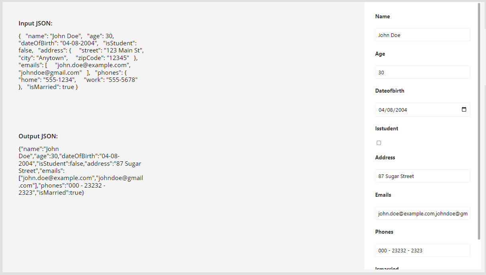
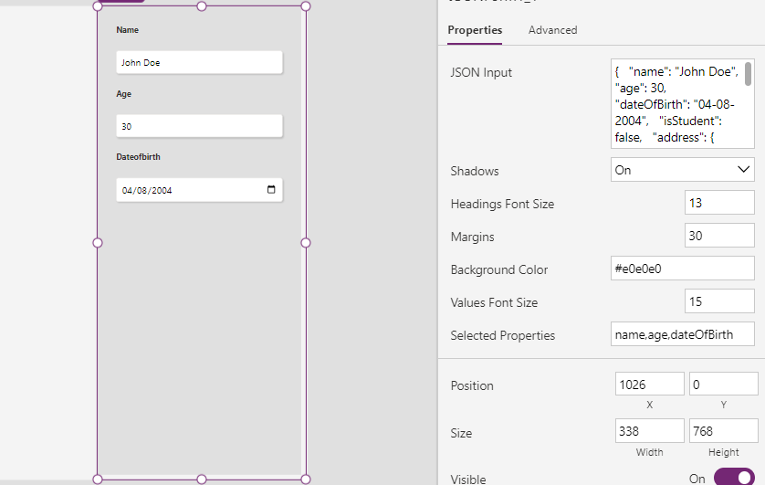

# JSONViewForm PCF Control

The **JSONViewForm** PCF (Power Apps Component Framework) control is designed to dynamically render form elements based on JSON data. It provides a flexible way to visualize and interact with JSON data within Power Apps.



## Features

- Dynamically generates form elements based on JSON data.
- Supports different input types for string, boolean, and numeric properties.
- Allows filtering form elements based on selected properties.
- Updates JSON data as the user interacts with the form elements.
- Provides error handling for invalid JSON input.

## Installation

To use the **JSONViewForm** PCF control in your Power Apps environment, follow these steps:

1. Build the PCF control using the provided source code. Or download solution from [here](./Solution/JSONForm.zip)
2. Import the control solution into your Power Apps environment.
3. Add the control to your desired app screen or form.

## Usage

### Parameters

- **JSONInput**: The JSON data input used to dynamically generate the form.
- **SelectedProperties**: (Optional) Comma-separated list of property names from the JSON input. If provided, only these properties will be displayed on the form.
- **BackgroundColor**: (Optional) The color value for form background.
- **HeadingsFontSize**: (Optional) The font size for form headings.
- **ValuesFontSize**: (Optional) The font size for form Values.
- **Margins**: (Optional) Specifies the form margins.
- **Shadows**: Shadow option for form inputs. Default = Off.

### Example

```typescript
import { IInputs, IOutputs } from "./generated/ManifestTypes";
import './style/JSONViewForm.css'

export class JSONViewForm implements ComponentFramework.StandardControl<IInputs, IOutputs> {
    // Implementation details...
}
```

## Contributing

Contributions to the **JSONViewForm** PCF control are welcome! To contribute, please follow these steps:

1. Fork the repository.
2. Create a new branch for your feature or fix.
3. Make your changes and test thoroughly.
4. Submit a pull request describing your changes.

## License

The **JSONViewForm** PCF control is licensed under the [MIT License](LICENSE).

## Author

This PCF control is authored by [Shaheer Ahmad](https://github.com/shaheerahmadch).


